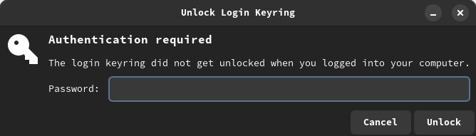
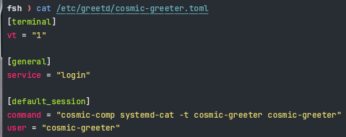

+++
title = "Temporary solution for 'gnome-keyring' with 'cosmic-greeter' on ArchLinux"
description = ""
date = 2025-01-19
updated = 2025-01-19
draft = false
tags = ['ArchLinux', 'keyring', 'greetd', 'COSMIC']
[extra]
toc = true
+++

# Intro
Since I used the cosmic desktop environment on ArchLinux, one issue always bothers me. Every time I restart/boot my laptop, the following message pops up and asks me to enter my password.



I know it must be related to `gnome-keyring` and `cosmic-greeter`, but I never try to solve it. Here is why:
- Enter the password, and it's gone until reboot.
- Cosmic desktop environment is in alpha, and it doesn't affect daily usage.


Until recently, I searched the term 'keyring' in the `cosmic-greeter` repo and I found [issue#87](https://github.com/pop-os/cosmic-greeter/issues/87).
It appears that the issue should already be fixed after alpha-2, so what is going on my laptop.

# tl;dr
> Go to [# Fixing the issue](#fixing-the-issue) if you want to skip the investigation part.

---

# What is the issue? and Why it happened?
The first thing I did is comparing the content of `cosmic-greeter.toml`.
| Expected | Actual |
|---|---|
|  |  |
> Content of expected content: [cosmic-greeter.toml (tag: alpha-2)](https://github.com/pop-os/cosmic-greeter/blob/epoch-1.0.0-alpha.2/cosmic-greeter.toml)
>
> The command for finding `cosmic-greeter.toml`: `fd cosmic-greeter.toml /`

To confirm the version of `cosmic-greeter` on my machine, I run the following command:
```bash
paru -Qs cosmic-greeter
# local/cosmic-greeter 1.0.0.alpha.5.1-1 (cosmic)
#     COSMIC greeter for greetd
```
So clearly, something happened in the packaging progress.

## PKGBUILD
Next, I start looking into the [package](https://gitlab.archlinux.org/archlinux/packaging/packages/cosmic-greeter/-/blob/1.0.0.alpha.5.1-1/PKGBUILD).

In line 46 of `PKGBUILD`, [the patch](https://github.com/pop-os/cosmic-greeter/pull/124/commits/ef1253aa2393666bb2a0b0132b722f51ec7ebbf3) is reverted.
```bash
# revert pam config for now
git revert -n ef1253aa2393666bb2a0b0132b722f51ec7ebbf3
```
Here is issue that relate to this revert: [#3](https://gitlab.archlinux.org/archlinux/packaging/packages/cosmic-greeter/-/issues/3), [#4](https://gitlab.archlinux.org/archlinux/packaging/packages/cosmic-greeter/-/issues/4)

There is nothing I can do about this, but at least I know why this happened.

---

# Other solutions?
I know `cosmic-greeter` is a greeter for `greetd`, so I tried editing `/etc/pam.d/greetd`. Unfortunately, it doesn't work.
> Method from the [ArchLinux wiki](https://wiki.archlinux.org/title/GNOME/Keyring#Using_the_keyring)

However, I notice a line in the greeter's patch.
```rust
// examples/pam.rs
// ...
  "login",             // Service name, decides which policy is used (see `/etc/pam.d`)
// ...
```
So I guess there might be a connection between `/etc/pam.d/login` and `general.service` in the toml file.
To confirm that, I study the source code of `greetd`.

## `greetd`
Luckily, the answer is at the top of the `main` function.
```rust
pub async fn main(config: Config) -> Result<(), Error> {
    let service = if Path::new(&format!("/etc/pam.d/{}", config.file.general.service)).exists() {
        &config.file.general.service
    } else if Path::new(&format!("/usr/lib/pam.d/{}", config.file.general.service)).exists() {
        &config.file.general.service
    } else {
        return Err(format!("PAM '{}' service missing", config.file.general.service).into());
    };
// ...
```

Here is the code related to config parsing.
```rust
const GENERAL_SERVICE: &str = "greetd";
// ...
impl Default for ConfigGeneral {
    fn default() -> Self {
        ConfigGeneral {
            source_profile: true,
            runfile: RUNFILE.to_string(),
            service: GENERAL_SERVICE.to_string(),
        }
    }
}
// ...
fn parse_config(config_str: &str) -> Result<ConfigFile, Error> {
    let config = inish::parse(config_str)?;
    let general = match config.get("general") {
        Some(section) => {
            // ...
            let servicestr = section.get("service").unwrap_or(&GENERAL_SERVICE);
            // ...
        }
        None => Default::default(),
    };
```
And my assumption is correct, `cosmic-greeter` is using `/etc/pam.d/login` instead of `/etc/pam.d/greetd`.

# Fixing the issue
> Note: The step is similar to the solution in the ArchLinux wiki, you should also take a look.
> [https://wiki.archlinux.org/title/GNOME/Keyring#Using_the_keyring](https://wiki.archlinux.org/title/GNOME/Keyring#Using_the_keyring)

1. Follow the ArchLinux wiki method:
```
# add this to end of the auth section
auth       optional     pam_gnome_keyring.so
# add this to end of the session section
session    optional     pam_gnome_keyring.so auto_start
```
2. Done, you can now reboot, and `gnome-keyring` should work as expected.
